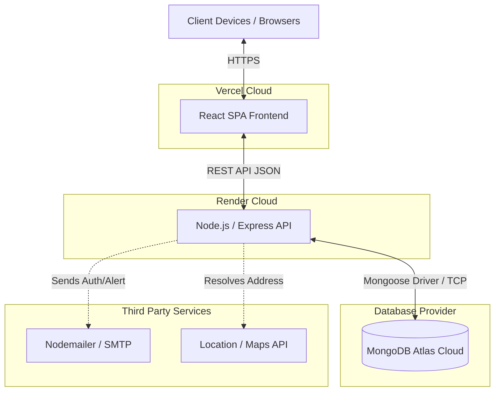
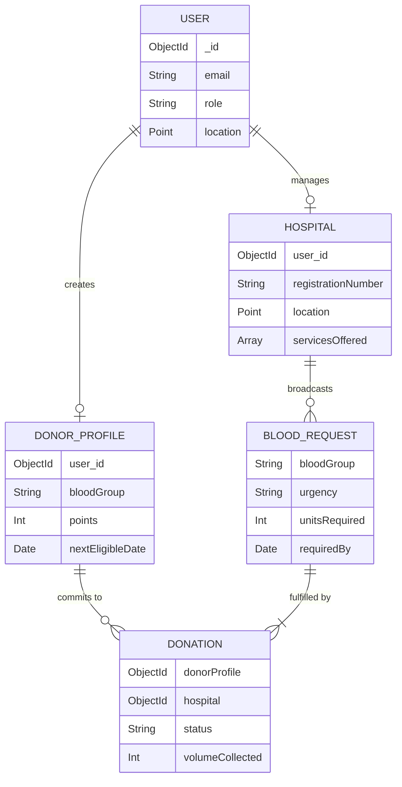
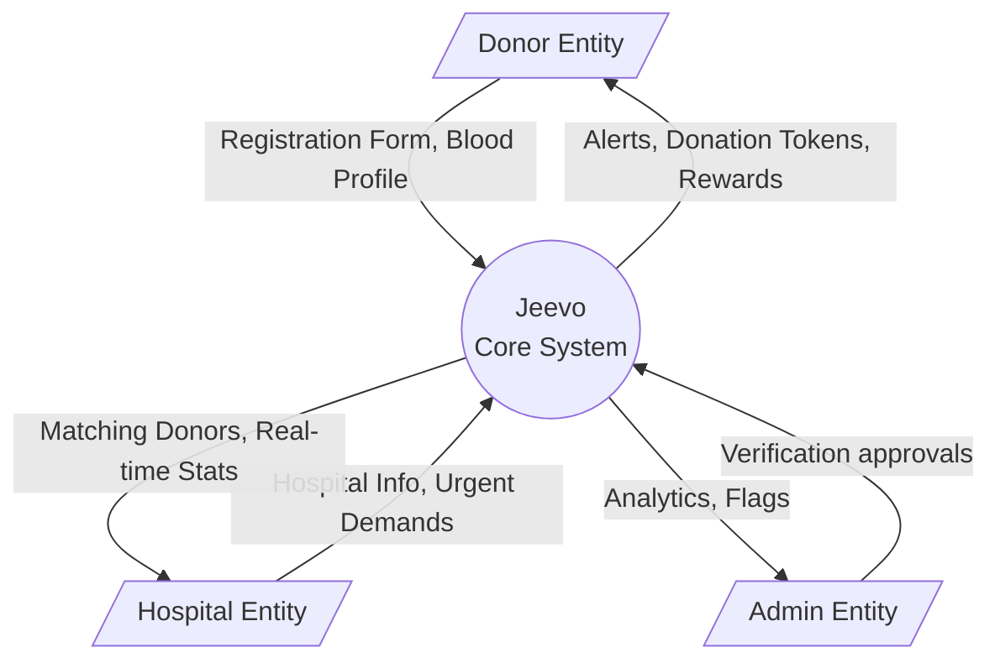
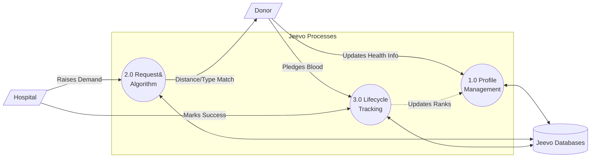
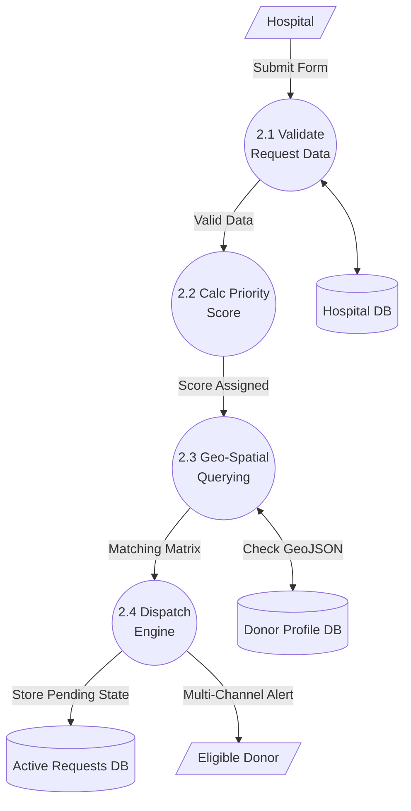

# Jeevo: Blood Donation Management Platform — Project Synopsis & System Documentation

## 1. Project Synopsis

### Background
Maintaining an adequate and safe blood supply is a critical healthcare challenge worldwide. Traditional blood donation systems often struggle with fragmented communication, manual record-keeping, and slow response times during emergencies. 

### Purpose & Objectives
**Jeevo** is a modern, full-stack web application designed to bridge the gap between blood donors, hospitals, and blood banks. The platform streamlines the entire blood donation lifecycle, ensuring rapid allocation during emergencies and incentivizing regular donations through gamification.

The main objectives are:
1. **Real-time Matching:** Instantly notify eligible donors based on geographic location and blood group compatibility.
2. **Simplified Inventory Management:** Allow hospitals to manage blood stock dynamically.
3. **Gamification & Rewards:** Encourage recurring donors through point systems, ranks, and achievements.
4. **Enhanced Security & Accountability:** Through Role-Based Access Control (RBAC) and verification protocols for both donors and hospitals.

### Scope
The platform provides three main portals:
- **Donor Portal:** Profile management, matching alerts, and donation tracking.
- **Hospital Portal:** Request broadcasting, inventory tracking, and blood collection verification.
- **Admin Portal:** Overall platform moderation, verifications, and analytical dashboards.

---

## 2. Platform Features

### User & Donor Features
- **Profile Registration & Health Screening:** Donors can securely register and complete an eligibility health declaration (weight, hemoglobin, conditions).
- **Gamified Rewards:** Donors earn points, badges (e.g., "Hero", "Platinum"), and progress through ranks based on volume and frequency of donations.
- **Automated Eligibility Tracking:** The system calculates biological wait periods (e.g., 90 days after whole blood donation) and enforces them automatically.
- **Push & Email Notifications:** Instant alerts when nearby hospitals raise critical/emergency matches for their blood type.

### Hospital & Blood Bank Features
- **Urgent Broadcasts:** Create blood requests categorized by urgency (Normal, Urgent, Critical, Emergency) to immediately blast nearby donors.
- **Inventory & Capacity Management:** Real-time visibility into overall hospital capacity (total beds, blood center limits) and matching status.
- **Donation Verification:** Hospital staff manage the end-to-end donation workflow: screening, phlebotomy, and issuing completion signals to update the donor's record.

### System & Admin Features
- **Intelligent Matching Algorithm:** Considers geolocation (distance to hospital) and exact ABO/Rh compatibility formulas.
- **Role-Based Access Control (RBAC):** Tight controls ensuring hospital staff, users, donors, and admins have distinct authorization ceilings.
- **Analytics & Reporting:** View counts, response rates, priority scores, and live status history for every request.

---

## 3. How It Works

1. **Onboarding:** A user registers and either becomes a *Donor* by providing detailed health criteria, or a *Hospital* by uploading verification documents (licenses, registrations).
2. **Emergency Triggering:** A verified Hospital creates a `BloodRequest` (specifying blood group, components, expected deadline, and urgency).
3. **Filtering & Broadcast:** The system calculates a `priorityScore`. It geometrically queries the DB (`2dsphere`) to find eligible, available donors within the hospital's radius whose blood type matches.
4. **Notification:** Matched donors receive alerts across SMS/Email.
5. **Commitment & Collection:** A donor accepts the request, schedules an appointment, and visits the hospital. Post-donation, the hospital updates the `Donation` status to `completed`, automatically triggering the donor’s reward cycle and adjusting the hospital's request `unitsFulfilled`.

---

## 4. System Architecture & Deployment Structure

Jeevo is built on the **MERN Stack** (MongoDB, Express, React, Node.js). 
The deployment relies on modern cloud-native architectures:
- **Client (Frontend):** Deployed effortlessly on **Vercel**, benefiting from edge-networking, dynamic CDN, and seamless CI/CD.
- **Server (Backend):** Deployed on **Render** utilizing scalable Web Services to host the Express API payload handling.
- **Database:** Hosted on **MongoDB Atlas**, structured using Mongoose ORM utilizing GeoJSON indexing for map radii logic.

### 4.1 Deployment Diagram

---

## 5. Unified Modeling Language (UML) Diagrams

### 5.1 Entity Relationship Diagram (ERD)

### 5.2 Data Flow Diagram (DFD) - Level 0 (Context Level)

### 5.3 Data Flow Diagram (DFD) - Level 1

### 5.4 Data Flow Diagram (DFD) - Level 2 (Decomposition of Request Matching)

